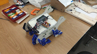

# Arduino Code Instruction
`Aug 24 2023` by [Ruiqi Mao](https://github.com/Richard17425)

1. **Disconnect** the `RX` and `TX` Pin from bluetooth module and CNC board before you upload the code to the Arduino board. When you want to connect the Bluetooth module with the CNC, the `RX` of Bluetooth (green wire for my panda walker) should be connected to the `TX` of CNC. Similarly, `TX` from BLuetooth (Blue wire) should be connected to `RX` on CNC.
2. The **speed definitions** of the motors on both sides of different walkers will be different. In this code there is a twofold difference in the speed of the motors on both sides. If running on other walkers, the **motor speed parameters need to be modified according to the actual situation**.
3. The code [TwoMotorContro](/TwoMotorContro_test0809/TwoMotorContro_test0809.ino) is used for **walking test**. When you turn on the power, the walker will walk according to the setting. You can always disconnect the bluetooth module from the CNC board when using this code, so that you can upload the code directly to the Arduino every time.
4. The code [TwoMotorControlBT](/TwoMotorControlBT0816/TwoMotorControlBT0816.ino) is used for **bluetooth remote control**. This document may help you understand how to use the bluetooth remote: [Walker_Control](/Electronics_for_Walker_Control.pdf).

> setSpeed of the motors 

| Action     |Left setSpeed| Right setSpeed |
| :---         |  :----:  |  :---:  |
| Max running  |   2300   |  -1200  |
| walk Straight|   720    |   -380  |
| trun Left    |   700    |   -700  |
| trun Right   |   1100   |   -300  |
| trun Around  |   720    |    380  |

 ## Demos: 
|**Walking straight**| **Turn Around:** |
|  :----:  |  :---:  | 
|.gif) | | 

## Other documents that can be referenced: 
> 1. [StepperMotorShield](/StepperMotorShield.pdf) 
> 2. [CNC Setup](/CNC%20Shield%20Setup.pdf)

   
